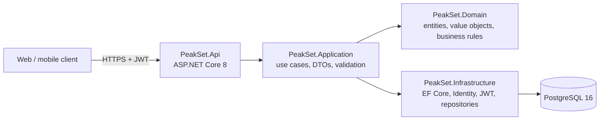
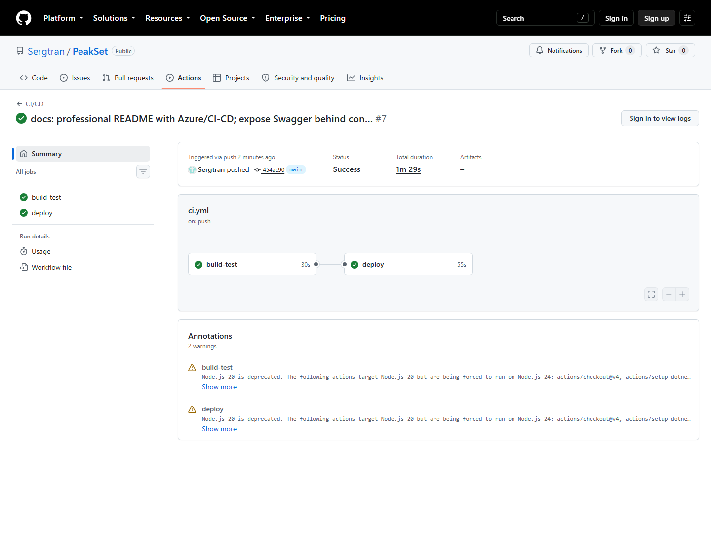

# PeakSet

**Training and progress tracker for strength training.** Plan your routines, log every set, and follow your progress over time.

[](https://github.com/Sergtran/PeakSet/actions/workflows/ci.yml)
[](https://dotnet.microsoft.com/)
[](https://www.postgresql.org/)
[](https://azure.microsoft.com/)


## Overview

PeakSet is a REST API for tracking strength training. It manages training routines, planned sessions, completed workouts, personal records, calendar history, statistics and per-user preferences.

The API is built with ASP.NET Core 8 following Clean Architecture and Domain-Driven Design, persists data in PostgreSQL through Entity Framework Core, and authenticates users with ASP.NET Core Identity and JWT bearer tokens.

## Features

- **Routines**: create training routines with planned sessions and exercises, and mark one as the current routine.
- **Workout logging**: record completed workouts with sets, reps and weight, including unilateral/bilateral and time-based exercises.
- **Personal records**: PR status is computed per exercise when a workout is saved, while historical values are preserved.
- **Progress analytics**: per-exercise progress, top exercises, routine usage and routine statistics.
- **Calendar**: monthly training history by year and month.
- **Backup**: export and import a complete user data set.
- **Authentication**: user registration and login with JWT access tokens.
- **API documentation**: interactive OpenAPI/Swagger UI.

## Architecture



| Layer | Responsibility |
|---|---|
| `PeakSet.Domain` | Entities, value objects and business rules. No external dependencies. |
| `PeakSet.Application` | Use cases, DTOs and validation rules. |
| `PeakSet.Infrastructure` | EF Core persistence, repositories, Identity and JWT. |
| `PeakSet.Api` | REST controllers, error handling middleware, Swagger and dependency wiring. |
| `PeakSet.Tests` | Unit tests for the domain and application layers. |

## Tech stack

| Area | Technology |
|---|---|
| Runtime | .NET 8 / ASP.NET Core |
| Language | C# 12 |
| Persistence | Entity Framework Core + PostgreSQL 16 |
| Authentication | ASP.NET Core Identity + JWT |
| Validation | FluentValidation |
| API documentation | Swagger / OpenAPI (Swashbuckle) |
| Testing | xUnit (35 tests) |
| Local runtime | Docker Compose |
| CI/CD | GitHub Actions with Azure OIDC authentication |
| Hosting | Azure App Service + Azure Database for PostgreSQL |

## Repository layout

```text
.
├── .github/workflows/ci.yml   # Build, test and deploy pipeline
├── assets/                    # Brand assets
├── backend/                   # .NET solution
│   ├── src/PeakSet.Api
│   ├── src/PeakSet.Application
│   ├── src/PeakSet.Domain
│   ├── src/PeakSet.Infrastructure
│   ├── tests/PeakSet.Tests
│   ├── Dockerfile
│   └── PeakSet.sln
├── docs/                      # Repository documentation
├── docker-compose.yml         # Local PostgreSQL + API stack
└── README.md
```

## Getting started

### Prerequisites

- [.NET 8 SDK](https://dotnet.microsoft.com/download/dotnet/8.0)
- [Docker Desktop](https://www.docker.com/products/docker-desktop/) (optional, for the local stack)

### Run the full stack with Docker

Create your local environment file from the template:

```bash
cp .env.example .env
```

Then start PostgreSQL and the API:

```bash
docker compose up -d
```

- API: http://localhost:8080
- Swagger UI: http://localhost:8080/swagger

### Run the API locally

```bash
cd backend
dotnet run --project src/PeakSet.Api
```

By default the API looks for a PostgreSQL instance configured through `ConnectionStrings__DefaultConnection` or `appsettings.Development.json`.

### Run the tests

```bash
cd backend
dotnet test PeakSet.sln --configuration Release
```

## Configuration

| Variable | Description |
|---|---|
| `ConnectionStrings__DefaultConnection` | PostgreSQL connection string. |
| `Jwt__Issuer` | JWT issuer. |
| `Jwt__Audience` | JWT audience. |
| `Jwt__Key` | Symmetric signing key (at least 32 characters). |
| `Jwt__ExpirationMinutes` | Access token lifetime in minutes. |
| `Swagger__Enabled` | Enables Swagger UI outside the Development environment. |
| `ASPNETCORE_ENVIRONMENT` | Hosting environment (`Development`, `Production`). |

In Azure App Service these settings are stored as application settings; no secrets are committed to the repository.

## API reference

Base URL: `https://peakset-api.azurewebsites.net`

Interactive documentation: `https://peakset-api.azurewebsites.net/swagger`

| Method | Endpoint | Description |
|---|---|---|
| `POST` | `/api/auth/register` | Register a new user and return a JWT. |
| `POST` | `/api/auth/login` | Authenticate a user and return a JWT. |
| `GET` | `/api/home` | Dashboard summary for the current user. |
| `GET` | `/api/routines` | List the routines of the current user. |
| `POST` | `/api/routines` | Create a routine. |
| `GET` | `/api/routines/{id}` | Get a routine with its sessions and exercises. |
| `PUT` | `/api/routines/{id}` | Update a routine. |
| `DELETE` | `/api/routines/{id}` | Delete a routine. |
| `POST` | `/api/routines/{routineId}/sessions` | Add a planned session. |
| `PUT` | `/api/routines/{routineId}/sessions/{sessionId}` | Update a planned session. |
| `DELETE` | `/api/routines/{routineId}/sessions/{sessionId}` | Delete a planned session. |
| `POST` | `/api/routines/{routineId}/sessions/{sessionId}/exercises` | Add an exercise to a session. |
| `PUT` | `/api/routines/{routineId}/sessions/{sessionId}/exercises/{exerciseId}` | Update a session exercise. |
| `DELETE` | `/api/routines/{routineId}/sessions/{sessionId}/exercises/{exerciseId}` | Remove a session exercise. |
| `GET` | `/api/routines/{id}/stats` | Routine statistics. |
| `GET` | `/api/routines/{id}/usage` | Routine usage metrics. |
| `GET` | `/api/routines/{id}/exercises/top` | Most used exercises in a routine. |
| `POST` | `/api/workouts` | Log a completed workout. |
| `GET` | `/api/workouts` | Paginated workout history. |
| `GET` | `/api/workouts/{id}` | Workout detail. |
| `PUT` | `/api/workouts/{id}` | Update a workout. |
| `DELETE` | `/api/workouts/{id}` | Delete a workout. |
| `GET` | `/api/exercises` | Exercise catalog. |
| `GET` | `/api/exercises/{name}/progress` | Progress history for an exercise. |
| `PUT` | `/api/users/me/current-routine` | Set the current routine. |
| `GET` | `/api/users/me/settings` | User theme and interval timer settings. |
| `PUT` | `/api/users/me/settings` | Update theme and interval timer settings. |
| `GET` | `/api/calendar/{year}/{month}` | Monthly training calendar. |
| `GET` | `/api/data/export` | Export the user data set. |
| `POST` | `/api/data/import` | Import a user data set. |

### Example: register and log in

```bash
curl -X POST https://peakset-api.azurewebsites.net/api/auth/register \
  -H "Content-Type: application/json" \
  -d '{"email":"user@example.com","password":"ChangeMe!123","displayName":"New User"}'
```

```bash
curl -X POST https://peakset-api.azurewebsites.net/api/auth/login \
  -H "Content-Type: application/json" \
  -d '{"email":"user@example.com","password":"ChangeMe!123"}'
```

Both endpoints return an access token that is sent to protected endpoints as `Authorization: Bearer <token>`.

### Error responses

Failures return RFC 7807 problem details with a machine readable list of errors, so clients translate
by code instead of matching prose:

```json
{
  "title": "Validation failed",
  "status": 400,
  "detail": "Password must have at least one non alphanumeric character.",
  "errors": [
    { "code": "PasswordRequiresNonAlphanumeric", "message": "Passwords must have at least one non alphanumeric character." }
  ]
}
```

Codes come from ASP.NET Identity for account rules (`PasswordTooShort`, `DuplicateUserName`, ...) and
from the validators for request rules (`EmailInvalid`, `SetWeightInvalid`, ...). Internal failures
never expose the underlying exception message.

## Database

The schema is managed with Entity Framework Core migrations. To apply migrations to a database:

```bash
cd backend
dotnet ef database update --project src/PeakSet.Infrastructure --startup-project src/PeakSet.Api
```

## Deployment

The API is hosted on **Azure App Service** (Linux) with an **Azure Database for PostgreSQL** flexible server. Both resources run in the same Azure region and the database connection requires SSL.

The deployment pipeline runs on every push to `main`:

```text
Push to main ──► restore ──► build and test ──► deploy to Azure App Service
Pull request ──► restore ──► build and test
```

Authentication with Azure uses **GitHub Actions OIDC** and a federated credential, so no long-lived Azure credentials are stored in GitHub.



## License

Copyright © PeakSet. All rights reserved.
